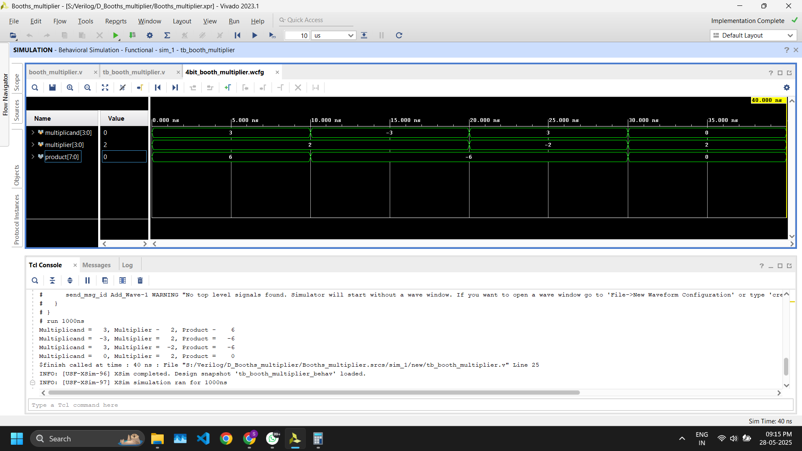

# 🧮 4-bit Booth's Multiplier in Verilog

This project implements a **4-bit signed Booth's Multiplier** in Verilog, along with a testbench and simulation outputs. Booth's algorithm is an efficient technique for multiplying binary numbers in signed 2's complement representation.

---

## 📌 Features

- Multiplies two **4-bit signed inputs**
- Produces an **8-bit signed output**
- Implements Booth's Algorithm for optimized multiplication
- Includes **testbench** with multiple test cases
- Verified through simulation using **Vivado**

---

## 📁 File Structure

```
4bit_booth's_multiplier/
├── src/
│ └── booth_multiplier.v 
├── sim/
│ ├── tb_booth_multiplier.v 
│ ├── 4bit_booth_multiplier.png 
│ ├── 4bit_booth_multiplier.wcfg 
│ ├── 4bit_implement_schematic.pdf 
│ └── 4bit_rtl_schematic.pdf 

```
---

## 🧠 Booth's Algorithm Overview

Booth’s algorithm is used for multiplying two signed binary numbers. It reduces the number of addition and subtraction operations, making it more efficient than the standard binary multiplication method, especially for sequences of 1s.

---

## 🔧 How It Works

Booth's algorithm analyzes adjacent bits in the multiplier to determine whether to:
- Add the multiplicand (01 pattern)
- Subtract the multiplicand (10 pattern)
- Do nothing (00 or 11 pattern)

This approach reduces the number of required addition/subtraction operations and improves efficiency, especially for signed numbers.

---

## 🛠️ How to Simulate

1. Open the project in [Xilinx Vivado](https://www.xilinx.com/products/design-tools/vivado.html) or any Verilog simulator.
2. Compile both `booth_multiplier.v` and `tb_booth_multiplier.v`.
3. Run the simulation and load the `.wcfg` file if using Vivado to view waveform (`4bit_booth_multiplier.png` shows an example).
4. Analyze results and schematics from the PDFs provided.

---

## 📝 Files to Note

- **booth_multiplier.v**: Contains the logic of 4-bit Booth's multiplier.
- **tb_booth_multiplier.v**: Includes various test cases to validate functionality.
- **4bit_implement_schematic.pdf**: Synthesized implementation view of the circuit.
- **4bit_rtl_schematic.pdf**: RTL schematic generated from the design.

---

## 💡 Design Overview

### 📄 `booth_multiplier.v`

- The core multiplication is handled within a `while` loop inside an `always` block.
- The algorithm uses registers `A`, `Q`, `Q_1`, and `M` to simulate the Booth's algorithm step-by-step.

### 🧪 tb_booth_multiplier.v

The testbench provides a variety of test cases:
- Positive × Positive
- Negative × Positive
- Positive × Negative
- Zero × Positive

Output is displayed using `$display`.

---

## 📷 Sample Output



---

## 🧠 Concepts Demonstrated

- 2's complement signed multiplication
- Booth's algorithm for signed binary multiplication
- Testbench-based simulation
- RTL and implementation schematics in Vivado

---

## 👨‍💻 Author

**Sarthak Aggarwal**  
📘 B.Tech ECE, Delhi Technological University  
🔗 [LinkedIn](https://www.linkedin.com/in/sarthak-aggarwal-486b60240/)  
📧 [sarthakaggarwal30102003@gmail.com](mailto:sarthakaggarwal30102003@gmail.com)

---
